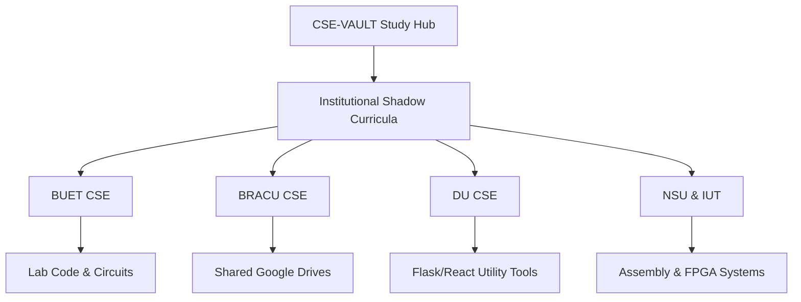

# 🌌 CSE-VAULT: The Academic Second Brain

Welcome to the **CSE-VAULT** — a decentralized, high-performance academic archive and structured study hub built to optimize Computer Science and Engineering (CSE) exam preparation and long-term subject mastery. 

This repository functions as an organized **"Second Brain,"** blending standard university coursework with global learning roadmaps, peer-to-peer shadow curricula, and high-yield regional resources.

---

## 🧭 Vault Quick Navigation

Use the directory mapping below to navigate directly into your Semester 1 academic subjects. Each subject folder contains structured study plans, high-yield master notes, and specialized, curated reference directories.

| Subject | 📅 Study Plan | 📝 Master Notes | 🔗 Curated Resources |
| :--- | :--- | :--- | :--- |
| 🧮 **Calculus and Vectors** | [Study Plan](./Semester_1/Calculus_and_Vectors/study_plan.md) | [Master Notes](./Semester_1/Calculus_and_Vectors/Calculus_and_Vectors_Master_Notes.md) | [Resources Guide](./Semester_1/Calculus_and_Vectors/RESOURCES.md) |
| 💻 **Structured Programming** | [Study Plan](./Semester_1/Structured_Programming/study_plan.md) | [Master Notes](./Semester_1/Structured_Programming/topic_notes/01_Midterm_C_Fundamentals.md) | [Resources Guide](./Semester_1/Structured_Programming/RESOURCES.md) |
| ⚡ **Physics I (Electromagnetism)** | [Topics Index](./Semester_1/Physics_I/Syllabus_and_Topics_Index.md) | [Master Notes](./Semester_1/Physics_I/Physics_I_Master_Notes.md) | [Resources Guide](./Semester_1/Physics_I/RESOURCES.md) |
| 🌐 **Technology and Society** | [Study Plan](./Semester_1/Technology_and_Society/study_plan.md) | [Exam Prep Guide](./Semester_1/Technology_and_Society/7_day_exam_prep.md) | [Resources Guide](./Semester_1/Technology_and_Society/RESOURCES.md) |
| 🗣️ **Communicative English** | *Pending Prep* | *Pending Master Notes* | [Resources Guide](./Semester_1/Comm_English/RESOURCES.md) |

---

## 🚀 The Global CS Education Infrastructure

Standardize your learning with globally recognized curricula, interactive platforms, and modular roadmaps curated by leading CS educators and academic institutions.

### 🗺️ Developer Roadmaps & Decentralized Degrees
*   **[Interactive Developer Roadmaps (roadmap.sh)](https://github.com/kamranahmedse/developer-roadmap):** Dynamic visual flowcharts detailing learning paths for Frontend, Backend, DevOps, Data Structures, AI, MLOps, Software Architecture, and specific languages (Python, C++, JS/TS).
*   **[Open Source Society University (OSSU)](https://github.com/ossu/computer-science):** A complete, community-curated computer science degree program mimicking a 4-year undergraduate major at elite universities (MIT, Harvard, Princeton) without filler.

### 🏛️ Elite Institutional Courseware
*   **[MIT OpenCourseWare (OCW)](https://ocw.mit.edu/):** Open access to lecture videos, exams, and codebases spanning decades of MIT instruction. Benchmark courses: *6.0001 Intro to CS in Python*, *18.S191 Computational Thinking*, and *RES.16-002 CAD/Engineering*.
*   **[Harvard CS50](https://cs50.harvard.edu/x/):** The world-standard, high-production introduction to computer science, covering low-level memory management, algorithms, and web development.
*   **[Stanford Engineering Everywhere (SEE)](https://see.stanford.edu/):** Unrestricted access to Stanford's computer science engine, offering lecture videos, quizzes, and complete course syllabus packs.

---

## 🇧🇩 Regional Academic Microcosms & Local Shadow Curricula

In Bangladesh's intense technical landscape, academic excellence is sustained through a powerful culture of student-maintained archives, sessional coding portfolios, and digital drives. Use these archives to cross-examine lab implementations and local exam strategies.

### 🏛️ University Shadow Portals

#### 1. Bangladesh University of Engineering and Technology (BUET)
*   **The Academic Ethos:** Driven by extreme peer-to-peer group study dynamics, textbook rigor (Cormen's CLRS, Patterson & Hennessy), and high-intensity lab projects.
*   **Master Academics Archive:** [TamimEhsan/CSE-BUET-Academics](https://github.com/TamimEhsan/CSE-BUET-Academics) contains sessional codes, MIPS 4-bit CPU circuit simulations built in Logisim, and HTTP server scripts.
*   **Comprehensive Student Portfolios:** [zarif98sjs](https://github.com/zarif98sjs/cse-buet-academics), [Anonto050](https://github.com/Anonto050/Undergraduate-Academics-BUET_CSE), and [BRAINIAC2677](https://github.com/BRAINIAC2677/BUET-CSE-Courseworks) document deep undergraduate laboratories.
*   **Admission & Study Manuals:** Localized exam roadmaps and Scribd manuals for MSc preparations covering dynamic programming, boolean logic, and networking.

#### 2. BRAC University (BRACU)
*   **Ahsanul Kabir Resource Portal:** Custom aggregates for CGPA calculation, USIS billing portals, academic APA/IEEE citation tools, and Z-Library reference collections.
*   **Google Drive Course Repositories:** Exhaustive course drives containing slide decks, lecture recordings, and past exam question sheets for core structures (*CSE110, CSE220, CSE320, CSE330*) and electives (*CSE422, CSE427*).
*   **Laboratory Repositories:** Portfolios by [udoysaha103](https://github.com/udoysaha103/BRACU-resources) and compiler design setups by [ShababAhmedd](https://github.com/ShababAhmedd/CSE420_CompilerDesign).

#### 3. University of Dhaka (DU - CSEDU)
*   **CSEDU Student Utility Web Apps:** Muhaiminul Islam Ninad's [ninadgns.github.io](https://github.com/ninadgns/ninadgns.github.io) features React-based GPA tools, dynamic calendars synchronizing class routines, and automated Flask-backed Lab Report cover builders.
*   **Applied Software Projects:** Food trackers ([amit-sarker/MyFoodDiary](https://github.com/amit-sarker/MyFoodDiary)) and 2D graphics games developed using C++ and the SFML graphics library ([Sakib2263/AirStrike-Defense](https://github.com/Sakib2263/AirStrike-Defense)).

#### 4. North South University (NSU) & Islamic University of Technology (IUT)
*   **NSU Labs & Club Ecosystem:** Centralized organization repositories ([NSU-CSE](https://github.com/orgs/NSU-CSE/repositories)) hosting emu8086 assembly scripts, database management frameworks, and university portal managers built using modern React, Supabase, and PostgreSQL web stacks.
*   **IUT Notes and Sessional Archive:** Meticulous 10-semester folders ([rasoolZero](https://github.com/rasoolZero/IUT-Computer-Engineering-Projects-HW) and [alvi-khan](https://github.com/alvi-khan/IUT-Notes-Archive)) featuring Proteus circuit schematics, Verilog hardware files, and QR-based meal card / student portal databases.

---

## 🎙️ Vernacular EdTech & Bengali Instruction

Bridge the gap between English-centric documentation and abstract computational logic with native-language masterclasses that connect classroom theory directly with corporate software engineering.

*   **[Learn with Sumit (Sumit Saha)](https://github.com/learnwithsumit):** Enterprise-level Javascript, React (*Think in a React way* series), Node.js rest API setups, Express.js web socket applications, and professional CBSE mathematics foundational trackers.
*   **[Stack Learner (HM Nayem & Shegufa Taranjum)](https://twinklecats.thinkific.com/):** The legendary *Full-Stack Army* MERN course covering array mechanics, systems design, networking, Linux terminal operations, and DevOps configurations.
*   **[Programming Hero (Jhankar Mahbub)](https://github.com/programming-hero):** Highly interactive, gamified software learning apps, beginner programming books, and structured web development bootcamps.
*   **[Bangla Programming Directories](https://ebookfoundation.github.io/free-programming-books/courses/free-courses-bn.html):** Curated GitHub indexes referencing free, native-language courses for Flutter, Go, Kotlin, PHP, and Dart.

---

## 🚀 Portfolio-Grade Project Domains & Systems Design

Recruiters overlook standard CRUD lists. The following domains provide blueprint concepts that solve real problems, make use of public APIs, and demonstrate architectural scalability.

| Project Domain | Blueprint Application | Primary Technology Stack | Key Educational Value |
| :--- | :--- | :--- | :--- |
| 🧠 **AI & Deep Learning** | On-Device Local LLM Assistant / Speech-to-Text Transcription | Python, TensorFlow.js, Whisper, MFCC | Teaches model execution on the edge, user data privacy, and speech feature extraction. |
| 🌐 **Full-Stack Web** | Collaborative Code Editor / Smart Campus Management Hub | Next.js, WebSockets, Laravel, Vue | Teaches real-time database synchronization, WebSockets, and state management under load. |
| 🔌 **IoT & Hardware** | U-Turn Collision Avoidance System / Smart Home Matrix | Arduino Uno, Raspberry Pi, C++, Proteus | Teaches sensor integration, low-level physical computing, and real-time hardware execution. |
| ⛓️ **Blockchain / Web3** | Decentralized Logistics & Supply Chain Tracker | Solidity, Web3.js, Ethereum, React | Teaches immutable ledger design, gas optimization, and smart contract security. |

---

## 💼 The Technical Interview Prep Arsenal

Navigating the transition from academic theory to corporate software engineering roles requires specialized, structured mock practice.

*   **[Coding Interview University](https://github.com/jwasham/coding-interview-university):** A multi-month study roadmap mapping standard data structures, algorithmic complexities (Big O), and computer systems.
*   **[Tech Interview Handbook](https://github.com/yangshun/tech-interview-handbook):** Curated questions, resume-building tips, and algorithmic tricks for standard technical assessments.
*   **[The System Design Primer](https://github.com/donnemartin/system-design-primer):** The gold standard for learning how to architect massive distributed systems (load balancers, CDN caching, database sharding, and write-ahead logs).
*   **Live Mock Platforms:** Use [Pramp](https://www.pramp.com/), [InterviewBit](https://www.interviewbit.com/), and [Interviewing.io](https://interviewing.io/) to conduct peer-to-peer mock verbal interviews to practice talking out loud while writing algorithms.

---

## 💬 Community & Academic Accountability Hubs
*   **Bangladesh Competitive Programming Society (BCS) Discord:** An 11,000+ member non-profit hub powered by Orbitax Bangladesh for daily Codeforces, LeetCode, and ICPC practice.
*   **Electronics Hardware School Discord:** Open Bengali forums providing mentorship on PCB design, schematic layouts, and practical circuit testing.
*   **Study Together Global Discord:** Live 24/7 video and screen-share rooms for Pomodoro compliance, protecting concentration during 5-hour sessions.

---

> [!TIP]
> **How to Use this Vault:** 
> 1. Complete your core course syllabus notes under the `Semester_1` folder.
> 2. Whenever you encounter a complex theory block (e.g., in Structured Programming or Physics), check the subject's local `RESOURCES.md` to view video playlists from *Learn with Sumit* or review real-world lab implementations from the *BUET* sessional folders.
> 3. Use the Pomodoro checklist in [study_strategy_guide.md](./study_strategy_guide.md) to guard against fatigue.
