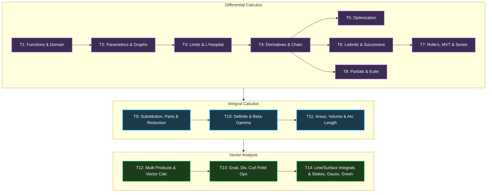

# 🗺️ Master Syllabus & Study Index: Calculus & Vectors (0541-101)

Welcome to your central navigation engine for **Calculus and Vectors (0541-101)**. This index maps your first-year first-semester curriculum into highly practical, active recall concepts. It translates advanced mathematical abstractions into computational logic and game physics analogies.

---

## 📂 Navigation Index

| Topic | Category | Key Principles | Study Guide Link |
| :--- | :--- | :--- | :--- |
| **Topic 1** | Differential | Real Numbers, Functions, Domain & Range | [01_Functions_Domain_Range.md](file:///c:/Users/CM/OneDrive/Desktop/mid=exam/Semester_1/Calculus_and_Vectors/Topic_1_Functions_Domain_Range/01_Functions_Domain_Range.md) |
| **Topic 2** | Differential | Shifting Graphs, Parametric Equations | [02_Graphing_Parametric_Equations.md](file:///c:/Users/CM/OneDrive/Desktop/mid=exam/Semester_1/Calculus_and_Vectors/Topic_2_Graphing_Parametric/02_Graphing_Parametric_Equations.md) |
| **Topic 3** | Differential | Limits, Continuity, L'Hospital's Rule | [03_Limits_LHospital_Rule.md](file:///c:/Users/CM/OneDrive/Desktop/mid=exam/Semester_1/Calculus_and_Vectors/Topic_3_Limits_LHospital/03_Limits_LHospital_Rule.md) |
| **Topic 4** | Differential | Geometric Derivatives, Tangents, Chain Rule | [04_Differentiation_Tangents.md](file:///c:/Users/CM/OneDrive/Desktop/mid=exam/Semester_1/Calculus_and_Vectors/Topic_4_Differentiation_Tangents/04_Differentiation_Tangents.md) *(Proposed)* |
| **Topic 5** | Differential | Critical Points, Optimization, Min/Max | [05_Optimization.md](file:///c:/Users/CM/OneDrive/Desktop/mid=exam/Semester_1/Calculus_and_Vectors/Topic_5_Optimization/05_Optimization.md) *(Proposed)* |
| **Topic 6** | Differential | Successive Diff, Leibnitz's Theorem, Normals | [06_Leibnitz_Theorem_Successive_Diff.md](file:///c:/Users/CM/OneDrive/Desktop/mid=exam/Semester_1/Calculus_and_Vectors/Topic_6_Leibnitz_Theorem_and_Successive_Differentiation/06_Leibnitz_Theorem_Successive_Diff.md) |
| **Topic 7** | Differential | Rolle's & Mean Value Theorems, Taylor/Maclaurin | [07_Mean_Value_Theorems_and_Series.md](file:///c:/Users/CM/OneDrive/Desktop/mid=exam/Semester_1/Calculus_and_Vectors/Topic_7_Mean_Value_Theorems_and_Series/07_Mean_Value_Theorems_and_Series.md) |
| **Topic 8** | Differential | Partial Derivatives, Homogeneous Functions, Euler's | [08_Partial_Derivatives_and_Euler_Theorem.md](file:///c:/Users/CM/OneDrive/Desktop/mid=exam/Semester_1/Calculus_and_Vectors/Topic_8_Partial_Derivatives_and_Euler_Theorem/08_Partial_Derivatives_and_Euler_Theorem.md) |
| **Topic 9** | Integral | Substitution, Integration by Parts, Reduction | [09_Integration_Techniques_and_Reduction.md](file:///c:/Users/CM/OneDrive/Desktop/mid=exam/Semester_1/Calculus_and_Vectors/Topic_9_Integration_Techniques_and_Reduction/09_Integration_Techniques_and_Reduction.md) |
| **Topic 10** | Integral | Definite Properties, FTC, Beta & Gamma Functions | [10_Definite_Integrals_and_Beta_Gamma.md](file:///c:/Users/CM/OneDrive/Desktop/mid=exam/Semester_1/Calculus_and_Vectors/Topic_10_Definite_Integrals_and_Beta_Gamma/10_Definite_Integrals_and_Beta_Gamma.md) |
| **Topic 11** | Integral | Area Bounded, Rectification, Solids of Revolution | [11_Geometric_Applications_of_Integration.md](file:///c:/Users/CM/OneDrive/Desktop/mid=exam/Semester_1/Calculus_and_Vectors/Topic_11_Geometric_Applications_of_Integration/11_Geometric_Applications_of_Integration.md) |
| **Topic 12** | Vectors | Triple/Quadruple Products, Vector Calculus | [12_Vector_Operations_and_Calculus.md](file:///c:/Users/CM/OneDrive/Desktop/mid=exam/Semester_1/Calculus_and_Vectors/Topic_12_Vector_Operations_and_Calculus/12_Vector_Operations_and_Calculus.md) |
| **Topic 13** | Vectors | Gradient Vectors, Field Divergence, Spatial Curl | [13_Vector_Operators_Grad_Div_Curl.md](file:///c:/Users/CM/OneDrive/Desktop/mid=exam/Semester_1/Calculus_and_Vectors/Topic_13_Vector_Operators_Grad_Div_Curl/13_Vector_Operators_Grad_Div_Curl.md) |
| **Topic 14** | Vectors | Line/Surface/Volume Integrals, Stokes, Gauss, Green | [14_Vector_Theorems_Stokes_Gauss_Green.md](file:///c:/Users/CM/OneDrive/Desktop/mid=exam/Semester_1/Calculus_and_Vectors/Topic_14_Vector_Theorems_Stokes_Gauss_Green/14_Vector_Theorems_Stokes_Gauss_Green.md) |

---

## 🗺️ Core Topic Mapping

---

## ⚡ Active Recall Strategy: Vibe Checks & Math Syntax

### Topic 6: Successive Differentiation & Leibnitz's Theorem
*   **The Vibe Check (CS Analogy):** Leibnitz's Theorem is a recursively applied function pipeline that decomposes the higher-order derivative of a compound stream product. Think of it as computing the cumulative complexity of a nested callback or middleware stack.
*   **The Source Code (Math):**
    $$(uv)_n = \sum_{r=0}^n \binom{n}{r} u_{n-r} v_r = u_n v + n u_{n-1} v_1 + \frac{n(n-1)}{2!} u_{n-2} v_2 + \dots$$
*   **Gotchas & Traps:** Always select the polynomial component as $v$ because its derivatives eventually become zero ($v_k = 0$), causing the infinite sum to truncate cleanly!

### Topic 7: Rolle's, Mean Value Theorem, & Power Series
*   **The Vibe Check (CS Analogy):** The Mean Value Theorem guarantees that if an algorithm has an average execution throughput of 60 FPS across a frame run, there must be at least one clock tick where the instantaneous processing rate was exactly 60 FPS. Taylor series expansions act as polynomial approximation lookups used by GPU shaders to compute heavy transcendental operations (like `sin` or `exp`) in $O(1)$ time.
*   **The Source Code (Math):**
    *   *MVT:* $f'(c) = \frac{f(b) - f(a)}{b - a} \quad$ for $c \in (a,b)$
    *   *Maclaurin Series:* $f(x) = \sum_{n=0}^\infty \frac{f^{(n)}(0)}{n!} x^n$
*   **Gotchas & Traps:** Rolle's and Mean Value Theorems are invalid if the function has even a single non-differentiable point (like a sharp cusp, step, or asymptote) anywhere inside the interval!

### Topic 8: Partial Derivatives & Euler's Theorem
*   **The Vibe Check (CS Analogy):** Partial derivatives isolate independent variables in multi-dimensional states. It is the exact mechanic used in neural network Backpropagation, where gradients w.r.t individual weights are computed while treating all other weights as frozen constants. Euler's theorem describes homogeneous vector scaling ratios.
*   **The Source Code (Math):**
    *   *Homogeneity:* $f(tx, ty) = t^n f(x,y)$
    *   *Euler's Identity:* $x \frac{\partial u}{\partial x} + y \frac{\partial u}{\partial y} = nu$
*   **Gotchas & Traps:** For composite homogeneous functions (e.g., $u = \tan^{-1}(z)$ where $z$ is homogeneous), you **cannot** apply Euler's theorem directly to $u$. You must first isolate the homogeneous ratio: $\tan(u) = z$, and then differentiate $\tan(u)$.

### Topic 9: Advanced Integration & Reduction
*   **The Vibe Check (CS Analogy):** Integration by Parts (IBP) is the recursive execution of an integration loop. Reduction formulas are recursive algorithms that decrement power exponents in a loop until they hit a base case (e.g., $I_0$ or $I_1$), making them ideal candidates for dynamic programming.
*   **The Source Code (Math):**
    *   *IBP:* $\int u \, dv = uv - \int v \, du \quad$ *(Choose $u$ using the **LIATE** hierarchy)*
*   **Gotchas & Traps:** When performing repeated IBP, watch your minus signs carefully. Forgetting to distribute the negative sign across nested integrals is the single most common algebraic mistake.

### Topic 10: Definite Integrals & Beta-Gamma Functions
*   **The Vibe Check (CS Analogy):** Definite integration is like computing a hash sum across a data stream to aggregate total continuous state. Beta and Gamma functions act as continuous factorials that resolve infinite integrals in a single step—effectively operating as high-performance math library macros.
*   **The Source Code (Math):**
    *   *Gamma:* $\Gamma(n) = \int_0^\infty e^{-x} x^{n-1} \, dx = (n-1)!$
    *   *Beta:* $B(m, n) = \int_0^1 x^{m-1} (1-x)^{n-1} \, dx = \frac{\Gamma(m)\Gamma(n)}{\Gamma(m+n)}$
*   **Gotchas & Traps:** Remember that $\Gamma(n+1) = n!$, which means $\Gamma(5) = 4! = 24$, not $5!$. For fractional values, use the identity $\Gamma(1/2) = \sqrt{\pi}$.

### Topic 11: Geometric Applications of Integration
*   **The Vibe Check (CS Analogy):** Rectification calculates path distance in a vector grid. Disk and shell revolutions represent the mathematical rasterization of 3D polygon meshes revolving around axes in CAD engines.
*   **The Source Code (Math):**
    *   *Arc Length:* $s = \int_a^b \sqrt{1 + (y')^2} \, dx$
    *   *Volume (Disk):* $V = \int_a^b \pi [f(x)]^2 \, dx$
*   **Gotchas & Traps:** Double check your axis of rotation. Revolving around the $y$-axis requires different radius and height formulas (Shell Method vs. Disk Method) compared to revolving around the $x$-axis.

### Topic 12: Vector Algebra & Vector Calculus
*   **The Vibe Check (CS Analogy):** Scalar triple product determines the volume of a 3D bounding box (oriented parallelepiped) in collision detection engines. Linear independence verifies if a set of basis coordinates spans a complete spatial frame without redundant vectors (colinearity/coplanarity).
*   **The Source Code (Math):**
    *   *Triple Product:* $\vec{a} \times (\vec{b} \times \vec{c}) = (\vec{a}\cdot\vec{c})\vec{b} - (\vec{a}\cdot\vec{b})\vec{c}$
    *   *Derivatives:* $\frac{d}{dt}[\vec{u}(t) \cdot \vec{v}(t)] = \vec{u}'(t)\cdot\vec{v}(t) + \vec{u}(t)\cdot\vec{v}'(t)$
*   **Gotchas & Traps:** Vector cross products are non-commutative: $\vec{a} \times \vec{b} = -(\vec{b} \times \vec{a})$. Order of operations is critical when evaluating multiple cross products.

### Topic 13: Grad, Div, Curl operators
*   **The Vibe Check (CS Analogy):** 
    *   *Gradient:* Direction of steepest ascent (the slope vector in gradient descent or terrain normal generation).
    *   *Divergence:* Net rate of expansion or compression (fluid mass entering vs. exiting a region in a physics simulation).
    *   *Curl:* Rotational eddy currents (vortex simulation around rigid bodies).
*   **The Source Code (Math):**
    *   *Grad:* $\nabla \phi = \frac{\partial \phi}{\partial x}\hat{i} + \frac{\partial \phi}{\partial y}\hat{j} + \frac{\partial \phi}{\partial z}\hat{k}$
    *   *Div:* $\nabla \cdot \vec{F} = \frac{\partial F_1}{\partial x} + \frac{\partial F_2}{\partial y} + \frac{\partial F_3}{\partial z}$
    *   *Curl:* $\nabla \times \vec{F} = \begin{vmatrix} \hat{i} & \hat{j} & \hat{k} \\ \frac{\partial}{\partial x} & \frac{\partial}{\partial y} & \frac{\partial}{\partial z} \\ F_1 & F_2 & F_3 \end{vmatrix}$
*   **Gotchas & Traps:** Divergence outputs a **scalar** field, while Gradient and Curl both output **vector** fields. Never write a unit vector ($\hat{i}, \hat{j}, \hat{k}$) in a divergence result!

### Topic 14: Advanced Vector Integration & Theorems
*   **The Vibe Check (CS Analogy):** Stokes, Green's, and Divergence theorems represent the mathematical equivalents of public APIs. They encapsulate complex internal high-dimensional integrations over volumes/surfaces and expose them as simple boundary line loops.
*   **The Source Code (Math):**
    *   *Green's:* $\oint_C (P\,dx + Q\,dy) = \iint_D \left( \frac{\partial Q}{\partial x} - \frac{\partial P}{\partial y} \right) dA$
    *   *Gauss:* $\iint_S \vec{F} \cdot d\vec{S} = \iiint_V (\nabla \cdot \vec{F}) \, dV$
    *   *Stokes:* $\oint_C \vec{F} \cdot d\vec{r} = \iint_S (\nabla \times \vec{F}) \cdot d\vec{S}$
*   **Gotchas & Traps:** These theorems only apply if the boundary curves are **closed** loops, and the vector field functions are continuous and differentiable everywhere inside the bounded region!

---

## 🏛️ The Exam Vault: Step-by-Step Solved University Problems

### 🎯 Problem 1 (Topic 6: Leibnitz's Theorem)
**Find the $n$-th derivative $y_n$ of the function $y = x^2 e^{2x}$.**

**Step-by-step Solution:**
1. Let $u = e^{2x}$ and $v = x^2$.
2. Calculate successive derivatives of $u$:
   * $u_1 = 2e^{2x}$
   * $u_2 = 2^2 e^{2x}$
   * $u_n = 2^n e^{2x}$
   * $u_{n-1} = 2^{n-1} e^{2x}$
   * $u_{n-2} = 2^{n-2} e^{2x}$
3. Calculate successive derivatives of $v$:
   * $v_1 = 2x$
   * $v_2 = 2$
   * $v_3 = 0$ (all subsequent derivatives are zero)
4. Apply Leibnitz's Theorem:
   $$y_n = u_n v + \binom{n}{1} u_{n-1} v_1 + \binom{n}{2} u_{n-2} v_2$$
   Substitute our values into the formula:
   $$y_n = (2^n e^{2x}) \cdot x^2 + n (2^{n-1} e^{2x}) \cdot (2x) + \frac{n(n-1)}{2} (2^{n-2} e^{2x}) \cdot 2$$
5. Simplify the expression by factoring out $2^{n-2} e^{2x}$:
   $$y_n = 2^{n-2} e^{2x} \left[ 2^2 x^2 + 2n(2x) + n(n-1)(2)/2 \right]$$
   $$y_n = 2^{n-2} e^{2x} \left[ 4x^2 + 4nx + n(n-1) \right]$$

---

### 🎯 Problem 2 (Topic 8: Euler's Theorem)
**If $u = \sin^{-1}\left(\frac{x^2 + y^2}{x + y}\right)$, show that $x \frac{\partial u}{\partial x} + y \frac{\partial u}{\partial y} = \tan(u)$.**

**Step-by-step Solution:**
1. Since $\sin^{-1}$ prevents direct homogeneity, isolate it by taking the sine of both sides:
   $$z = \sin(u) = \frac{x^2 + y^2}{x + y}$$
2. Determine the degree $n$ of the homogeneous function $z(x,y)$:
   $$z(tx, ty) = \frac{(tx)^2 + (ty)^2}{tx + ty} = \frac{t^2(x^2 + y^2)}{t(x + y)} = t^1 z(x,y)$$
   Therefore, $z$ is homogeneous of degree $n = 1$.
3. Apply Euler's Theorem to $z$:
   $$x \frac{\partial z}{\partial x} + y \frac{\partial z}{\partial y} = 1 \cdot z$$
4. Compute the partial derivatives of $z = \sin(u)$ w.r.t $x$ and $y$ using the chain rule:
   $$\frac{\partial z}{\partial x} = \cos(u) \frac{\partial u}{\partial x} \quad \text{and} \quad \frac{\partial z}{\partial y} = \cos(u) \frac{\partial u}{\partial y}$$
5. Substitute these partial derivatives into Euler's equation:
   $$x \left( \cos(u) \frac{\partial u}{\partial x} \right) + y \left( \cos(u) \frac{\partial u}{\partial y} \right) = \sin(u)$$
6. Factor out $\cos(u)$ and divide both sides:
   $$\cos(u) \left( x \frac{\partial u}{\partial x} + y \frac{\partial u}{\partial y} \right) = \sin(u)$$
   $$x \frac{\partial u}{\partial x} + y \frac{\partial u}{\partial y} = \frac{\sin(u)}{\cos(u)} = \tan(u) \quad \text{[Q.E.D.]}$$

---

### 🎯 Problem 3 (Topic 10: Beta and Gamma Functions)
**Evaluate the definite integral $\int_0^{\pi/2} \sin^6(x) \cos^4(x) \, dx$.**

**Step-by-step Solution:**
1. Recall the trigonometric definition of the Beta function:
   $$\int_0^{\pi/2} \sin^p(x) \cos^q(x) \, dx = \frac{1}{2} B\left(\frac{p+1}{2}, \frac{q+1}{2}\right)$$
2. Here, $p = 6$ and $q = 4$. Calculate the arguments:
   $$\frac{p+1}{2} = \frac{7}{2}, \quad \frac{q+1}{2} = \frac{5}{2}$$
3. Rewrite the integral using the Beta-Gamma relationship:
   $$I = \frac{1}{2} B\left(\frac{7}{2}, \frac{5}{2}\right) = \frac{1}{2} \cdot \frac{\Gamma(7/2)\Gamma(5/2)}{\Gamma(7/2 + 5/2)}$$
   The denominator's Gamma argument is: $\frac{7}{2} + \frac{5}{2} = \frac{12}{2} = 6$.
4. Calculate each Gamma term individually:
   * $\Gamma(6) = (6-1)! = 5! = 120$
   * $\Gamma(7/2) = \frac{5}{2} \cdot \frac{3}{2} \cdot \frac{1}{2} \Gamma(1/2) = \frac{15}{8}\sqrt{\pi}$ (since $\Gamma(1/2) = \sqrt{\pi}$)
   * $\Gamma(5/2) = \frac{3}{2} \cdot \frac{1}{2} \Gamma(1/2) = \frac{3}{4}\sqrt{\pi}$
5. Substitute the values back into the expression:
   $$I = \frac{1}{2} \cdot \frac{\left( \frac{15}{8}\sqrt{\pi} \right) \cdot \left( \frac{3}{4}\sqrt{\pi} \right)}{120}$$
   $$I = \frac{1}{2} \cdot \frac{\frac{45}{32} \pi}{120} = \frac{45\pi}{2 \cdot 32 \cdot 120} = \frac{45\pi}{7680}$$
6. Simplify the fraction by dividing the numerator and denominator by $15$:
   $$I = \frac{3\pi}{512}$$

---

### 🎯 Problem 4 (Topic 13: Gradient & Conservative Vector Fields)
**Verify if the vector field $\vec{F} = (2xy + z^3)\hat{i} + x^2\hat{j} + 3xz^2\hat{k}$ is conservative, and find its scalar potential function $\phi(x,y,z)$.**

**Step-by-step Solution:**
1. A field is conservative if its curl is equal to the zero vector ($\nabla \times \vec{F} = \vec{0}$):
   $$\nabla \times \vec{F} = \begin{vmatrix} \hat{i} & \hat{j} & \hat{k} \\ \frac{\partial}{\partial x} & \frac{\partial}{\partial y} & \frac{\partial}{\partial z} \\ 2xy+z^3 & x^2 & 3xz^2 \end{vmatrix}$$
2. Calculate the components:
   * **$\hat{i}$ component:** $\frac{\partial}{\partial y}(3xz^2) - \frac{\partial}{\partial z}(x^2) = 0 - 0 = 0$
   * **$\hat{j}$ component:** $-\left( \frac{\partial}{\partial x}(3xz^2) - \frac{\partial}{\partial z}(2xy+z^3) \right) = -(3z^2 - 3z^2) = 0$
   * **$\hat{k}$ component:** $\frac{\partial}{\partial x}(x^2) - \frac{\partial}{\partial y}(2xy+z^3) = 2x - 2x = 0$
   Since curl $\vec{F} = \vec{0}$, **the field is conservative**.
3. Set up the gradient relationship $\nabla \phi = \vec{F}$ to find the scalar potential $\phi$:
   * $\frac{\partial \phi}{\partial x} = 2xy + z^3 \quad \implies \phi(x,y,z) = x^2 y + xz^3 + f(y,z)$  *(Equation A)*
   * $\frac{\partial \phi}{\partial y} = x^2 \quad \implies \phi(x,y,z) = x^2 y + g(x,z)$  *(Equation B)*
   * $\frac{\partial \phi}{\partial z} = 3xz^2 \quad \implies \phi(x,y,z) = xz^3 + h(x,y)$  *(Equation C)*
4. Merge the three expressions by taking all unique term groups:
   $$\phi(x,y,z) = x^2 y + xz^3 + C \quad \text{(where } C \text{ is the constant of integration)}$$

---

### 🎯 Problem 5 (Topic 14: Gauss's Divergence Theorem)
**Evaluate $\iint_S \vec{F} \cdot d\vec{S}$ where $\vec{F} = 4x\hat{i} - 2y^2\hat{j} + z^2\hat{k}$ over the surface of the closed cylinder bounded by $x^2 + y^2 = 4$, $z=0$, and $z=3$.**

**Step-by-step Solution:**
1. Apply Gauss's Divergence Theorem to convert the surface integral to a volume integral:
   $$\iint_S \vec{F} \cdot d\vec{S} = \iiint_V (\nabla \cdot \vec{F}) \, dV$$
2. Compute the divergence $\nabla \cdot \vec{F}$:
   $$\nabla \cdot \vec{F} = \frac{\partial(4x)}{\partial x} + \frac{\partial(-2y^2)}{\partial y} + \frac{\partial(z^2)}{\partial z} = 4 - 4y + 2z$$
3. Convert to cylindrical coordinates for the cylinder:
   $$x = r\cos\theta, \quad y = r\sin\theta, \quad z = z, \quad dV = r \, dz \, dr \, d\theta$$
   *   **Limits:** $r \in [0, 2]$, $\theta \in [0, 2\pi]$, $z \in [0, 3]$.
4. Set up the multivariable integral:
   $$I = \int_0^{2\pi} \int_0^2 \int_0^3 (4 - 4r\sin\theta + 2z) \cdot r \, dz \, dr \, d\theta$$
5. Integrate w.r.t $z$ first:
   $$\int_0^3 (4r - 4r^2\sin\theta + 2rz) \, dz = \left[ (4r - 4r^2\sin\theta)z + rz^2 \right]_0^3$$
   $$= 3(4r - 4r^2\sin\theta) + 9r = 21r - 12r^2\sin\theta$$
6. Integrate w.r.t $r$ next:
   $$\int_0^2 (21r - 12r^2\sin\theta) \, dr = \left[ \frac{21r^2}{2} - 4r^3\sin\theta \right]_0^2$$
   $$= \frac{21(4)}{2} - 4(8)\sin\theta = 42 - 32\sin\theta$$
7. Integrate w.r.t $\theta$ last over $[0, 2\pi]$:
   $$\int_0^{2\pi} (42 - 32\sin\theta) \, d\theta = \left[ 42\theta + 32\cos\theta \right]_0^{2\pi}$$
   $$= \left( 42(2\pi) + 32(1) \right) - \left( 0 + 32(1) \right) = 84\pi$$
   $$\iint_S \vec{F} \cdot d\vec{S} = 84\pi$$
