# 🧮 Topic 13: Vector Differential Operators - Grad, Div, Curl

This topic explores the spatial differential operator "Del" ($\nabla$) and its applications to scalar fields (potential, height, temperature) and vector fields (fluid velocity, gravity, electromagnetic fields).

## 📺 Top Tutorials
*   **[Divergence and Curl - 3Blue1Brown (Visual Essence)](https://www.youtube.com/results?search_query=divergence+and+curl+3blue1brown)**
*   **[The Gradient Vector - Intuitive Explanation](https://www.youtube.com/results?search_query=gradient+vector+calculus+explained)**

## 📑 Key Concepts
*   **The Del Operator ($\nabla$):**
    $$\nabla = \hat{i}\frac{\partial}{\partial x} + \hat{j}\frac{\partial}{\partial y} + \hat{k}\frac{\partial}{\partial z}$$
*   **Gradient (Grad $\phi$):** Operates on a scalar field $\phi(x,y,z)$ and outputs a **vector field** pointing in the direction of maximum spatial increase:
    $$\text{grad } \phi = \nabla \phi = \frac{\partial \phi}{\partial x}\hat{i} + \frac{\partial \phi}{\partial y}\hat{j} + \frac{\partial \phi}{\partial z}\hat{k}$$
*   **Divergence (Div $\vec{F}$):** Operates on a vector field $\vec{F} = F_1\hat{i} + F_2\hat{j} + F_3\hat{k}$ via dot product, outputting a **scalar field** representing source/sink flux expansion:
    $$\text{div } \vec{F} = \nabla \cdot \vec{F} = \frac{\partial F_1}{\partial x} + \frac{\partial F_2}{\partial y} + \frac{\partial F_3}{\partial z}$$
    *   *Solenoidal Field:* A field where $\nabla \cdot \vec{F} = 0$.
*   **Curl (Curl $\vec{F}$):** Operates on a vector field via cross product, outputting a **vector field** representing spatial rotational circulation:
    $$\text{curl } \vec{F} = \nabla \times \vec{F} = \begin{vmatrix} \hat{i} & \hat{j} & \hat{k} \\ \frac{\partial}{\partial x} & \frac{\partial}{\partial y} & \frac{\partial}{\partial z} \\ F_1 & F_2 & F_3 \end{vmatrix}$$
    *   *Irrotational Field:* A field where $\nabla \times \vec{F} = \vec{0}$.

## 🛠️ Practice These Problems
1.  Find the unit normal vector to the surface $x^2 y + 2xz = 4$ at the point $(2, -2, 3)$ using gradient.
2.  Calculate $\nabla \cdot \vec{F}$ and $\nabla \times \vec{F}$ for $\vec{F} = x^2 y \hat{i} + y^2 z \hat{j} + z^2 x \hat{k}$.
3.  Show that $\vec{v} = (y^2 \cos x + z^3)\hat{i} + (2y \sin x - 4)\hat{j} + (3xz^2 + 2)\hat{k}$ is an irrotational field, and find its scalar potential $\phi$.
4.  Prove that the divergence of a curl is always zero: $\nabla \cdot (\nabla \times \vec{A}) = 0$.

---
> **💡 Pro Tip:** Think of Gradient as elevation slope lines, Divergence as the net fluid flowing out of a pixel in a physical system, and Curl as the rotation of a tiny water paddlewheel placed at that pixel point!

---

## 📖 Deep Research Study Guide

## **Topic 13: Gradient, Divergence, and Curl Field Operators**

### **Theoretical Framework and Rules**

Multivariate vector fields rely exhaustively on partial differential operators—specifically represented by the Nabla operator (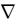)—to translate raw geometry into quantifiable physical properties. The gradient (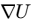) dictates the specific vector direction of the steepest mathematical ascent extending outward from a scalar level curve or equipotential surface.46 Divergence (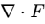) performs a dot-product interaction to calculate the scalar magnitude of source/sink flux generation per infinitesimal unit volume, determining if a fluid or field is expanding or compressing.46 Curl () determines the microscopic circulation (vorticity) of the vector field via cross-product derivations.46 When combined, the second-order Laplacian (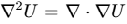) serves as the ultimate cornerstone. This operator is profoundly integrated into the fundamental laws of nature, from the heat diffusion equation to Schrödinger's wave equation in quantum mechanics, rendering these operators the absolute language of physical kinematics and force propagation.46

### **Foundational Problem Set**

| Problem | Theory, Formula, and Solution |
| :---- | :---- |
| **1\. Find the gradient of .** 46 | **Rule:** Gradient maps scalar to vector field. **Solution:** 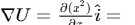. |
| **2\. Find the gradient of 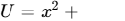 (or 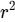).** 46 | **Rule:** Partial derivatives across all orthogonal axes. **Solution:** . |
| **3\. Find the divergence of 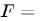.** 46 | **Rule:** Divergence maps vector to scalar field. **Solution:** 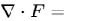. It represents a uniform expansion source. |
| **4\. Find divergence of position vector 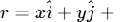.** 46 | **Rule:** Sum of diagonal Jacobian terms. **Solution:** 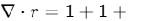. |
| **5\. Compute divergence of .** 46 | **Rule:** Inverse-square law fields. **Solution:** Using product rule identities for fields, the inward/outward flux perfectly balances. Result is exactly 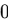. |
| **6\. Find the curl of .** 46 | **Rule:** Evaluates vorticity in 2D rigid rotation. **Solution:** 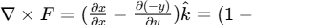. |
| **7\. Find the curl of 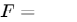.** 46 | **Rule:** 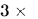 determinant. **Solution:** 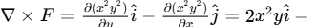. |
| **8\. Compute the Laplacian 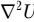 for 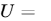.** 46 | **Rule:** Divergence of a Gradient. **Solution:** Since , we compute 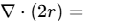. |
| **9\. Compute 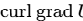 ().** 46 | **Rule:** Null vector identity (Identity 1). **Solution:** By strict vector operator identities, the curl of any potential gradient is always  (Irrotational). |
| **10\. Compute 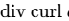 ().** 46 | **Rule:** Null scalar identity (Identity 2). **Solution:** By operator identities, the divergence of any curl is always  (Solenoidal). |
