# 🧮 Topic 14: Vector Integrals & Theorems - Green, Stokes, Gauss

This topic covers path-based, area-based, and volume-based integration of vector fields, along with the fundamental boundary theorems that link them together.

## 📺 Top Tutorials
*   **[Line Integrals, Surface Integrals, and Volume Integrals Visually](https://www.youtube.com/results?search_query=line+surface+volume+integrals+multivariable+calculus)**
*   **[Green's, Stokes's, and the Divergence Theorem - Visual Mapping](https://www.youtube.com/results?search_query=greens+stokes+divergence+theorem+essentials)**

## 📑 Key Concepts
*   **Line Integral:** $\int_C \vec{F} \cdot d\vec{r}$. Accumulates work done by vector field along path $C$.
*   **Surface Integral (Flux):** $\iint_S \vec{F} \cdot d\vec{S} = \iint_S \vec{F} \cdot \hat{n} \, dS$. Measures fluid volume flowing through surface $S$.
*   **Green's Theorem in 2D Plane:** Links line integral around loop $C$ to double integral over plane area $D$:
    $$\oint_C (P \, dx + Q \, dy) = \iint_D \left( \frac{\partial Q}{\partial x} - \frac{\partial P}{\partial y} \right) dx \, dy$$
*   **Stokes's Theorem in 3D Space:** Generalizes Green's Theorem to a 3D surface $S$ bounded by a closed loop curve $C$:
    $$\oint_C \vec{F} \cdot d\vec{r} = \iint_S (\nabla \times \vec{F}) \cdot d\vec{S}$$
*   **Gauss's Divergence Theorem:** Links outward surface flux through closed surface $S$ to volume expansion inside $V$:
    $$\iint_S \vec{F} \cdot d\vec{S} = \iiint_V (\nabla \cdot \vec{F}) \, dV$$

## 🛠️ Practice These Problems
1.  Evaluate the line integral $\int_C (x^2 y \, dx + xy^2 \, dy)$ where $C$ is the line segment from $(0,0)$ to $(1,1)$.
2.  Use Green's Theorem to evaluate $\oint_C (y^2 \, dx + 3xy \, dy)$ around the boundary of the semi-circle $x^2 + y^2 \leq 4, y \geq 0$.
3.  Verify the Divergence Theorem for $\vec{F} = x\hat{i} + y\hat{j} + z\hat{k}$ over the volume of the unit sphere.
4.  Use Stokes's Theorem to evaluate $\oint_C \vec{F} \cdot d\vec{r}$ where $\vec{F} = -y^3\hat{i} + x^3\hat{j} + z^3\hat{k}$ and $C$ is the circle $x^2 + y^2 = 1, z = 0$.

---
> **💡 Pro Tip:** These boundary theorems are the ultimate dimensional "shortcuts"! Instead of doing a complex, multi-sided 3D surface integral over all six faces of a cube, use Gauss's Divergence Theorem to convert it into a single, straightforward 3D volume integral!

---

## 📖 Deep Research Study Guide

## **Topic 14: Line, Surface, and Volume Integrals; Stokes, Gauss, and Green's Theorems**

### **Theoretical Framework and Rules**

The grand unification of vector analysis occurs via generalized topological theorems linking the interior properties of a domain to the physical constraints of its external boundaries (often generalized mathematically as 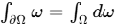). Gauss's Divergence Theorem connects the macroscopic surface flux of a vector field enclosing a 3D region directly to the sum of its internal volume divergence.47 Stokes' Theorem equates the macroscopic line integral around a closed boundary loop to the surface integral of the field's internal microscopic curl.47 Green's Theorem acts as the specific two-dimensional planar manifestation of these principles.47 Analytically, these theorems dictate a profound physical truth: internal energetic irregularities within any continuum must inherently reflect mathematically on its macroscopic enclosing surfaces. This serves as the core foundational proof for all conservation laws in fluid dynamics and Maxwell's equations in electromagnetism.

### **Foundational Problem Set**

| Problem | Theory, Formula, and Solution |
| :---- | :---- |
| **1\. Apply Green's Theorem to 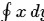 over ellipse 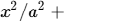.** 47 | **Rule:** 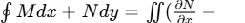. **Solution:** 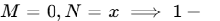. The double integral of 1 equals the area, 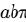. |
| **2\. Use Green's to explain 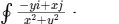 for regions avoiding origin.** 47 | **Rule:** Singularity boundary conditions. **Solution:** 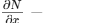. Since the integrated domain avoids the 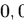 singularity, the integral evaluates to . |
| **3\. Calculate 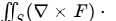 for 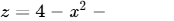.** 47 | **Rule:** Stokes' Theorem conversion to line integral. **Solution:** Convert surface to line integral over the circle 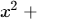 at . Due to symmetric trigonometric cancellation, it evaluates to exactly . |
| **4\. Compute flux of  over cylinder 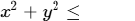.** 47 | **Rule:** Gauss's Divergence Theorem. **Solution:** 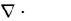. Integral converts from surface flux to volume accumulation, equating to cylinder volume: 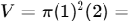. |
| **5\. Apply Stokes' to 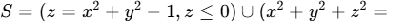.** 47 | **Rule:** Additive boundary orientations. **Solution:** Boundaries share unit circle in xy-plane but with opposing clockwise/counter-clockwise orientations. Line integrals cancel: . |
| **6\. Verify path integral 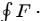 for  over unit circle.** 47 | **Rule:** Parametrize boundary bypassing Green's. **Solution:** . 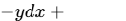. Integral is 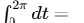. |
| **7\. Is 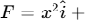 a conservative field?** 47 | **Rule:** Test if curl equals zero. **Solution:** Check mixed partials. . Not equal, therefore not conservative. |
| **8\. Find potential  if .** 47 | **Rule:** Integration of conservative vector field components. **Solution:** . Conservative. Integrating 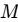 and 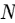 gives 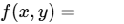. |
| **9\. Is 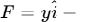 conservative?** 47 | **Rule:** Curl test for rotational fields. **Solution:** 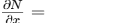. Partials are not equal; thus, no scalar potential function exists. |
| **10\. Find potential  for 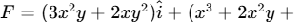.** 47 | **Rule:** Recover scalar function  from 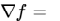. **Solution:** Curl is zero. Integrating  relative to  and  relative to  perfectly aligns to yield . |
