# 🛑 Topic 3: Limits & L'Hospital's Rule (Week 3)

The most important topic for scoring easy marks in the mid-term.

## 📺 Top Tutorials
*   **[Limits for Beginners (One Shot)](https://www.youtube.com/results?search_query=calculus+limits+crash+course)**
*   **[L'Hospital's Rule Step-by-Step](https://www.youtube.com/results?search_query=l%27hospital+rule+examples+calculus)**
*   **[Indeterminate Forms (0/0 and ∞/∞)](https://www.youtube.com/results?search_query=indeterminate+forms+calculus+explained)**

## 📑 Key Rules
*   **Direct Substitution:** Try plugging in the value first. If you get a number, you're done!
*   **L'Hospital's Rule:** If you get `0/0` or `∞/∞`, take the derivative of the top and the derivative of the bottom separately:
    *   `lim [f(x)/g(x)] = lim [f'(x)/g'(x)]`

## 🛠️ Practice These Problems
1.  Evaluate `lim (x→2) [ (x² - 4) / (x - 2) ]`.
2.  Use L'Hospital's Rule for `lim (x→0) [ sin(x) / x ]`.
3.  Solve a limit where you have to apply L'Hospital's Rule **twice**.

---
> **💡 Pro Tip:** L'Hospital's Rule **only** works for `0/0` or `∞/∞`. If you get `5/0`, it's an asymptote (Undefined/Infinity), not a L'Hospital problem!

---

## 📖 Deep Research Study Guide

## **Topic 3: Limits, Continuity, and L'Hôpital's Rule**

### **Theoretical Framework and Rules**

The concept of a mathematical limit fundamentally resolves the asymptotic behavior of a function as it approaches an undefined singularity or infinity. Limits formalize the notion of continuity, ensuring that a function exhibits no breaks, jumps, or asymptotic disruptions. However, evaluating limits often yields indeterminate forms such as 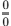 or 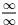. In these scenarios, L'Hôpital's Rule provides an elegant analytical rescue, dictating that 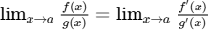.15 The profound theoretical trend here is the reduction of geometric limits to a pure comparison of independent infinitesimals. By assessing the instantaneous rates of change of the numerator against the denominator, one determines which component dominates the asymptotic expansion.16 If the oscillating frequencies of the expressions fail to stabilize, L'Hôpital's fails, necessitating alternative Taylor expansions or squeeze theorems.16

### **Foundational Problem Set**

| Problem | Theory, Formula, and Solution |
| :---- | :---- |
| **1\. Compute 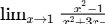.** 17 | **Rule:** Direct substitution yields indeterminate form 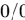. **Solution:** Using L'Hôpital's Rule, derive top and bottom: 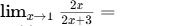. |
| **2\. Compute 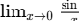.** 17 | **Rule:** Fundamental trigonometric limit,  form. **Solution:** Apply L'Hôpital's Rule: . |
| **3\. Compute 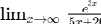.** 17 | **Rule:** Exponential vs. polynomial growth, 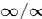 form. **Solution:** Apply L'Hôpital's Rule: 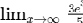. Since the numerator grows unbounded, the limit is 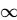. |
| **4\. Compute .** 18 | **Rule:** Repeated L'Hôpital for persistent . **Solution:** First derivative: 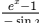, still . Second derivative: 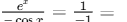. |
| **5\. Compute 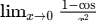.** 19 | **Rule:**  form requiring multiple iterations. **Solution:** First derivative: 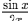 (still ). Apply again: 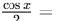. |
| **6\. Evaluate 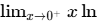.** 15 | **Rule:** Convert  into a fractional indeterminate form. **Solution:** Rewrite as 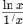 (Form 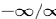). Apply L'Hôpital: 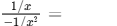. |
| **7\. Compute .** 19 | **Rule:** Convert 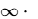 to fraction. **Solution:** Rewrite as 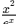 (). Apply L'Hôpital twice: 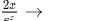. |
| **8\. Evaluate .** 20 | **Rule:**  form comparing logarithm and polynomial. **Solution:** Apply L'Hôpital: 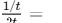. As 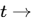, the fraction approaches . |
| **9\. Compute 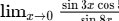.** 15 | **Rule:**  form with product rule in numerator. **Solution:** L'Hôpital: 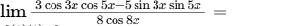. |
| **10\. Compute .** 15 | **Rule:** Form 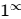, use natural logarithms. **Solution:** Let  be the limit. . L'Hôpital: 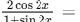. Thus, 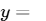. |
